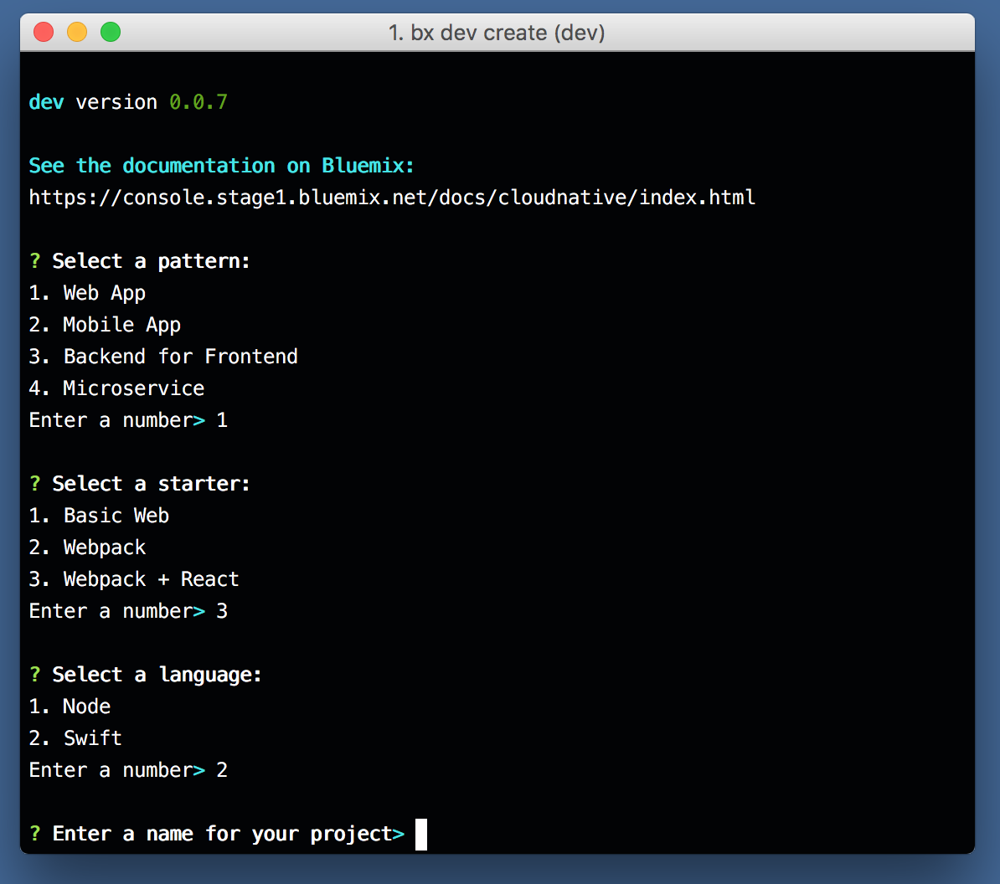
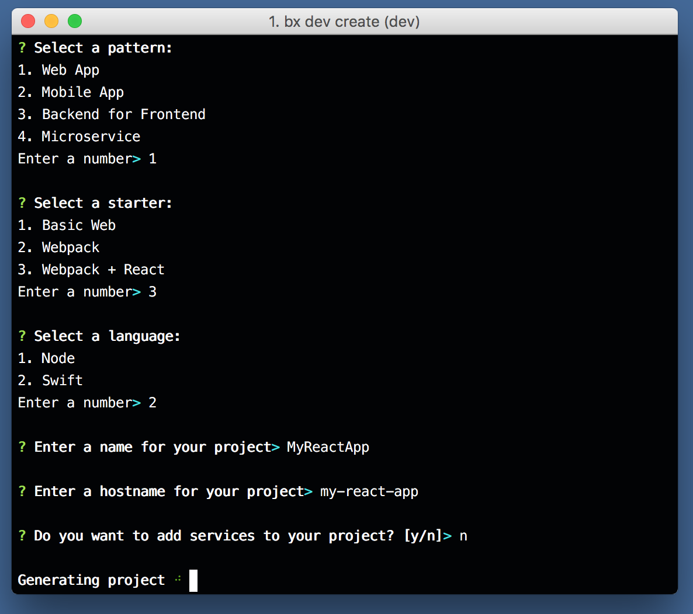
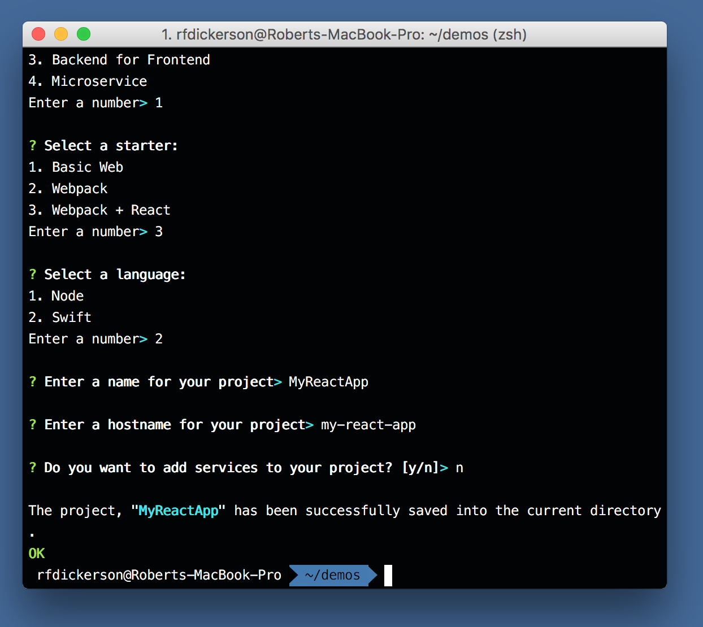
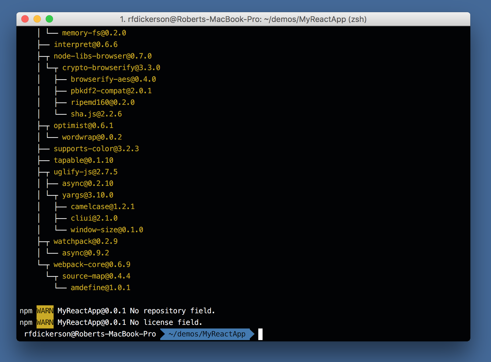
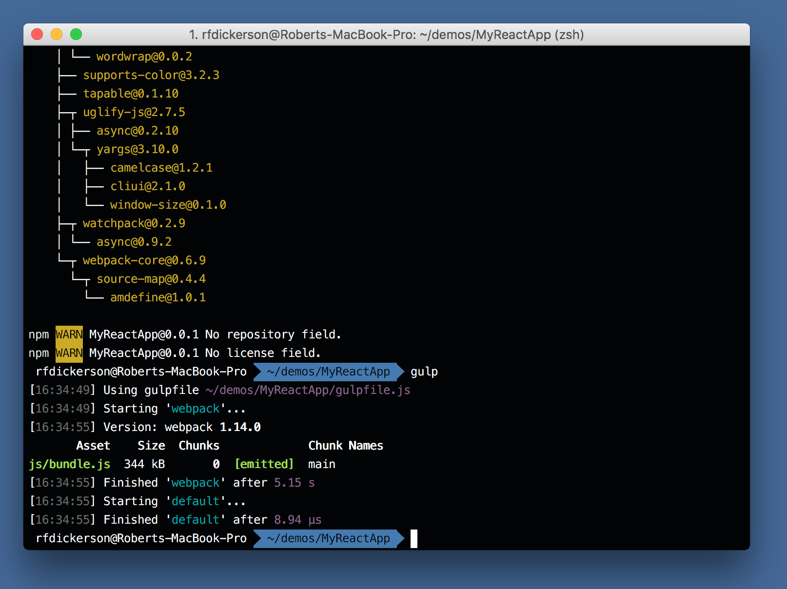
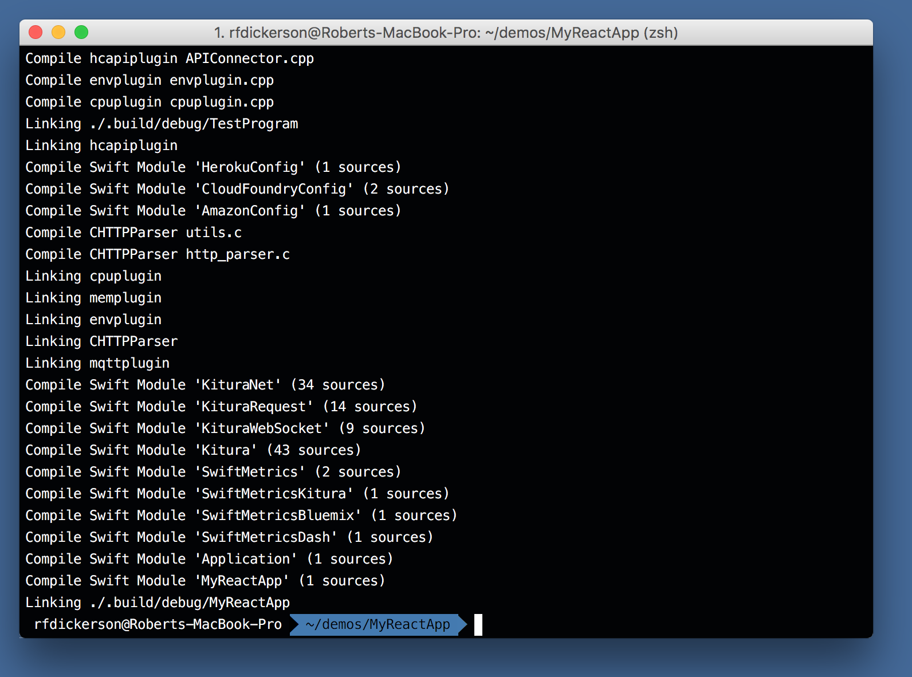
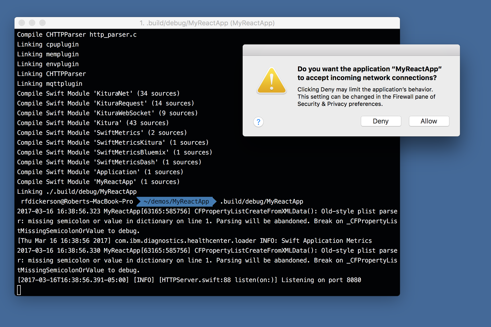
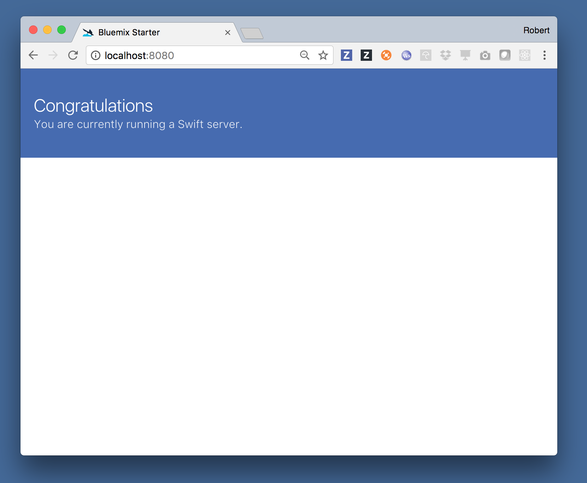
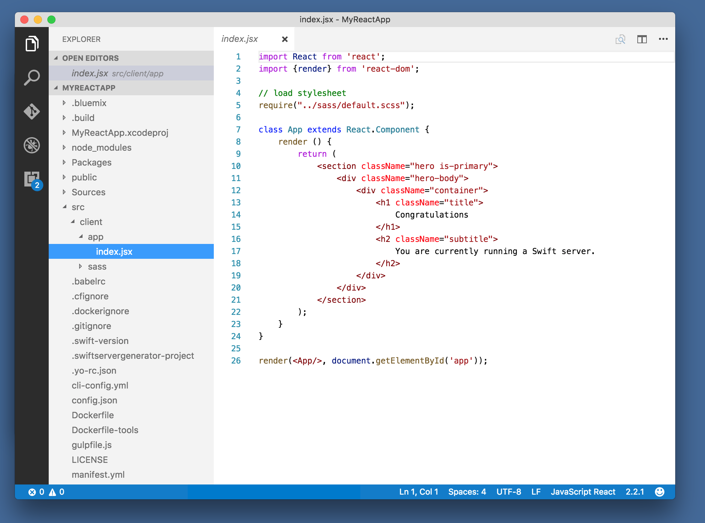
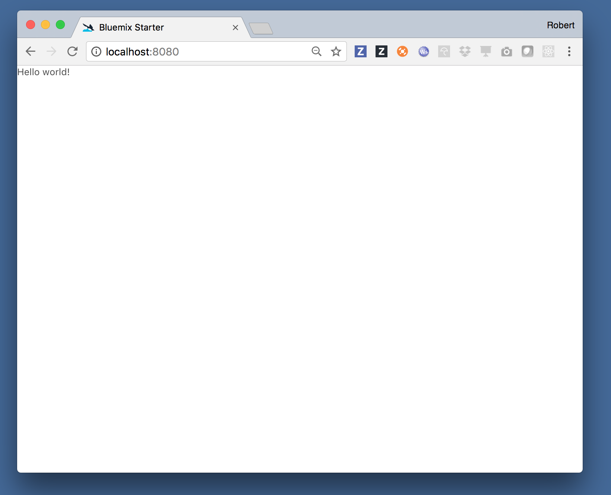

# Creating a complete web application with React and Kitura

Learn to scaffold out a complete web application that uses a Kitura server to serve a React-based UI:

## Prerequisites:

- [XCode 8.2+](https://developer.apple.com/download/)
- [Download and install the Bluemix CLI](https://plugins.ng.bluemix.net/ui/home.html)
- Download and install the Developer plugin for the Bluemix CLI:
   ```
   bx plugin install dev -r Bluemix
   ```
 
 ## Zero to Hero
 
3. Use the dev plugin to create a new project

 ```
 bx dev create
 ```
 
4. Select Web pattern, Webpack + React, and Swift
 
 
 
5. Name your project, give it a hostname, and select no services

 
 
6. Wait for your project to be generated (should take about 30 seconds)

 

 Once completed, you should see "The project, ... has been saved into the current directory."
 
7. Change into the directory of your project

 ```
 cd MyReact
 ```
 
8. Install the node packages:

 ```npm install```
 
  
 
8. Run gulp:

    ```
    gulp
    ```
    
    
    
9. Build the Swift project (takes 2 minutes)

    ```
    swift build
    ```
    
    When you run this command, the Swift Package Manager will download all of the dependencies your project needs into your `Packages` directory. Downloading the packages on your first compile, can take a bit of time. Future builds will be very fast, however.
    
    
    
    
    
10. Run the application

  It's time to run your application.
  
  ```
  .build/debug/MyReact
  ```
    
  You will probably be getting a message about accepting incoming connections if you're on macOS. Select 'Allow'. Notice that at the end of the run, the logger says that the server is running on port 8080.
    
  
    

11. Open your browser and see your running application.

    


## Modifing your application

1. Open your project in your favorite editor or IDE

  - If you want to use Xcode, run `swift package generate-xcodeproj` first.
  - VSCode, Atom, and Sublime are all good choices, too.

  
  
2. Make changes, for instance:

  ```javascript
  import React from 'react';
  import {render} from 'react-dom';

  // load stylesheet
  require("../sass/default.scss");

  class App extends React.Component {
    render () {
        return (
            <section>
                <p>Hello, World!</p>
            </section>
        );
    }
  }

  render(<App/>, document.getElementById('app'));
  ```
  
3. Re-run `gulp`

4. Refresh your browser

  
  
        

